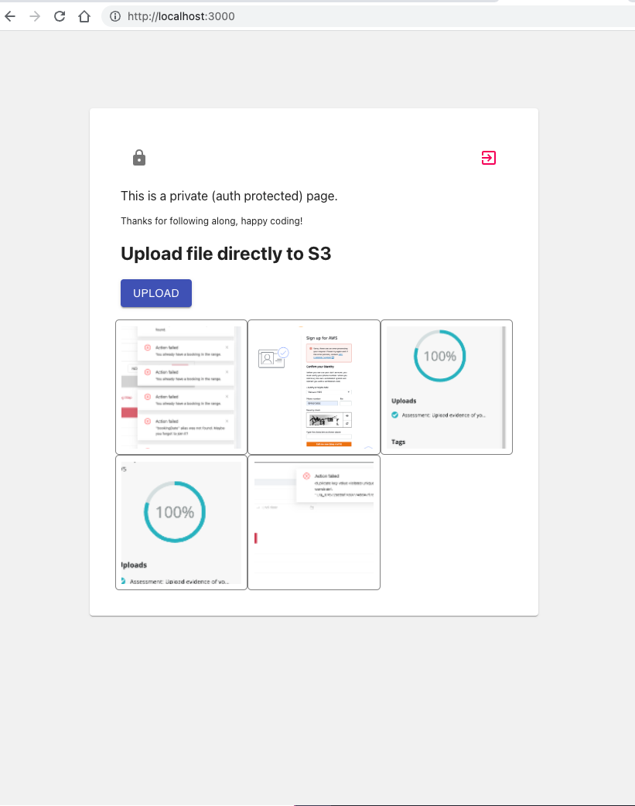

# AWS Amplify Upload S3 Directly

## Getting Started

#### Install dependencies

run `yarn` in the root directory

#### Change configuration

Create new `.env.local`

You can get the required info from you user pool. If you don't know how to setup aws cognito then please [read this first](https://dev.to/mubbashir10/implement-auth-in-react-easily-using-aws-cognito-5bhi)

For setting uploading files to S3 [read this second ](https://medium.com/@anjanava.biswas/uploading-files-to-aws-s3-from-react-app-using-aws-amplify-b286dbad2dd7)

#### Start the app

run `yarn start` in the root directory

#### Build the app (for production)

run `yarn build` in the root directory

## About AWS Cognito

AWS Cognito is a managed authentication service by AWS. To use it's APIs we use [AWS Amplify SDK](https://docs.amplify.aws/lib/auth/getting-started/q/platform/js#create-authentication-service). AWS Amplify is the AWS counterpart of Google's Firebase.

## Usage

- Email : https://yopmail.com/en/
- Phone: Use a valid format phone number.

## Screenshots

